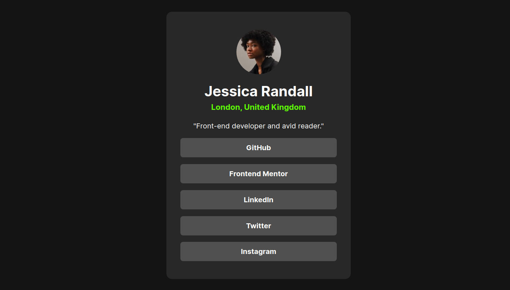
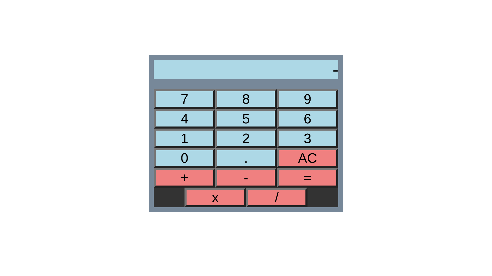
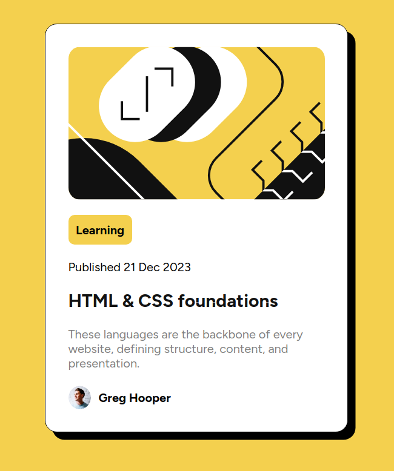

# Web Development Portfolio

## Author

Github - alejanCodeGF |
Email - alejan.gomez.fernandez@gmail.com |
Linkedin - /in/alejan-gomez-fernandez

## Description

This repository contains a collection of my HTML, CSS, and JavaScript exercices from Frontendmentor, The Odin Project and other online resources for web development.
The projects are designed to showcase my skills in creating functional and visually appealing websites.

You can browse through the website I've created to see the projects!

Live site: https://alejancodegf.github.io/Web-Development/index.html

## Screenshots

