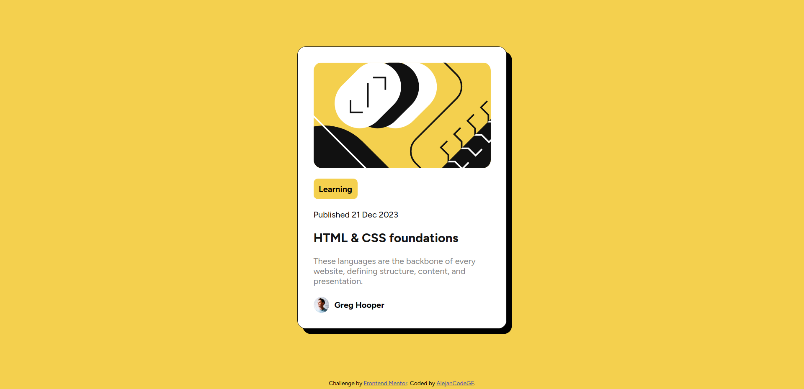

# Frontend Mentor - Blog preview card solution

This is a solution to the [Blog preview card challenge on Frontend Mentor](https://www.frontendmentor.io/challenges/blog-preview-card-ckPaj01IcS). Frontend Mentor challenges help you improve your coding skills by building realistic projects. 

## Table of contents

- [Overview](#overview)
  - [The challenge](#the-challenge)
  - [Screenshot](#screenshot)
  - [Links](#links)
- [My process](#my-process)
  - [Built with](#built-with)
  - [What I learned](#what-i-learned)
- [Author](#author)

## Overview

### The challenge

Users should be able to:

- See hover and focus states for all interactive elements on the page

### Screenshot

### Links

- Solution URL: [Github](https://github.com/alejanCodeGF/Web-Development/tree/main/frontendmentor.io/blog-preview-card-main)
- Live Site URL: [Github Pages](https://alejancodegf.github.io/Web-Development/frontendmentor.io/blog-preview-card-main/my_solution/index.html)

## My process

### Built with

- Semantic HTML5 markup
- CSS custom properties
- Flexbox

### What I learned

Most proud:
- Now I followed the "style-guide", and now it's more similar to the original.
- It's better responsive web design than the previous project, with the .svg with width 100% (if the card gets smaller, the photo too. More flexible).

## Author

- Github - [alejanCodeGF](https://www.your-site.com)
- Frontend Mentor - [@alejanCodeGF](https://www.frontendmentor.io/profile/alejanCodeGF)