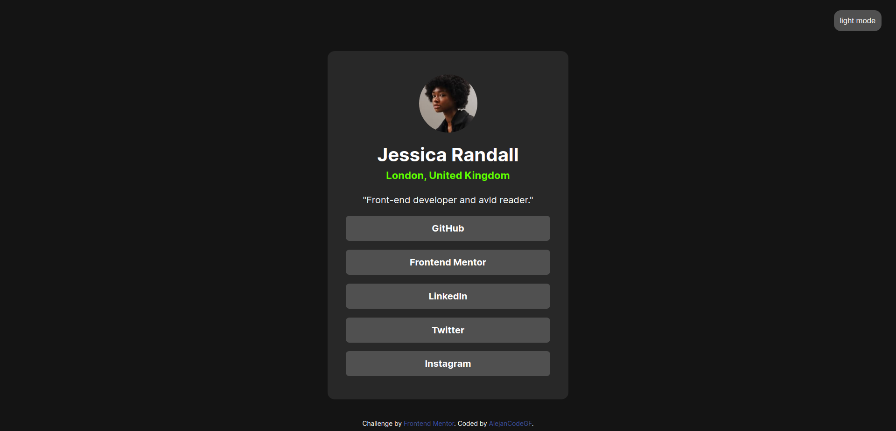

# Frontend Mentor - Social links profile solution

This is a solution to the [Social links profile challenge on Frontend Mentor](https://www.frontendmentor.io/challenges/social-links-profile-UG32l9m6dQ). Frontend Mentor challenges help you improve your coding skills by building realistic projects. 

## Table of contents

- [Overview](#overview)
  - [The challenge](#the-challenge)
  - [Screenshot](#screenshot)
  - [Links](#links)
- [My process](#my-process)
  - [Built with](#built-with)
  - [What I learned](#what-i-learned)
  - [Continued development](#continued-development)
- [Author](#author)

## Overview

### The challenge

Users should be able to:

- See hover and focus states for all interactive elements on the page

### Screenshot


### Links

- Solution URL: [Github](https://github.com/alejanCodeGF/Web-Development/tree/main/frontendmentor.io/social-links-profile-main)
- Live Site URL: [Github Pages](https://alejancodegf.github.io/Web-Development/frontendmentor.io/social-links-profile-main/my_solution/index.html)

## My process

### Built with

- Semantic HTML5 markup
- CSS custom properties
- Flexbox
- JavaScript

### What I learned

Most proud:
- Dark / light mode: I think the colors I choose for each mode are pretty good.
- Use of variables: I think my variables are well implemented. With 2 states for each mode, that changes visually pretty cool.

```html
<html lang="en" class="dark">
```
```css
html.dark {
    --background1: rgb(20, 20, 20);
    --background2: rgb(40, 40, 40);
    --background3: rgb(80, 80, 80);

    --green: rgb(94, 255, 0);

    --colorfont_default: white;
    --colorfont_alter: black;
}

html.light {
    --background1: rgb(230, 230, 230);
    --background2: rgb(210, 200, 190);
    --background3: rgb(177, 177, 177);

    --green: rgb(20, 168, 0);

    --colorfont_default: black;
    --colorfont_alter: white;
}
```
```js
change_theme_btn.addEventListener ("click", () => {
    html.className = (html.className == "dark") ? "light" : "dark"
});
```

Do differently next time:
One thing I did wrong is that I didn't saw the "style-guide" with all the colors and the sizes of the project. I did all by eye (I liked my version, but in the next projects I'll keep it in mind).

### Continued development

Responsive web design: I think the mobile and desktop design are not as good as could. I'll keep learning this for better responsive

## Author

- Github - [alejanCodeGF](https://www.your-site.com)
- Frontend Mentor - [@alejanCodeGF](https://www.frontendmentor.io/profile/alejanCodeGF)