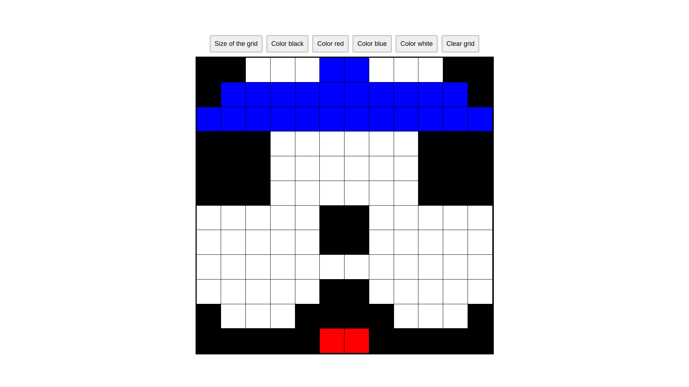

# Etch-a-Sketch

This project is a web-based version of the Etch A Sketch game. It is created with HTML, CSS, and JavaScript. The game is fully functional, and it allows users to draw and create their own designs.

## Features

- The game has a n x n grid of squares (n between 1 and 100, as you need)
- Users can draw lines by moving the cursor over the grid
- 4 different colors + raimbow color, which randomize the squares’ RGB values with each interaction
- Opacity mode with Progressive darkening effect, where each interaction adds 10% more black or color to the square. After 10 iterations you got the hole color
- Users can clear the screen by clicking the "Clear grid" button

Live site: https://alejancodegf.github.io/odin-Etch-a-Sketch/