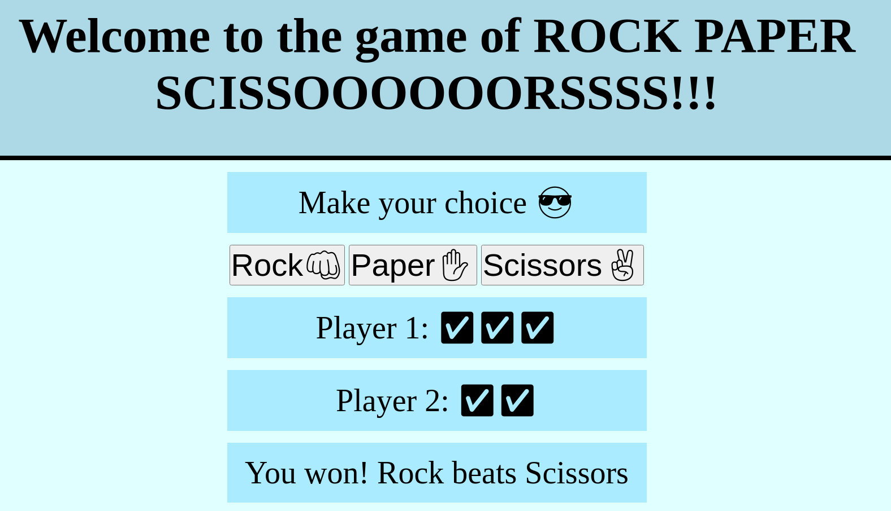

# Rock Paper Scissors with JS

## Description:

This is a simple Rock Paper Scissors game. The player chooses their move by typing in "rock", "paper", or "scissors", and the computer randomly generates its move.

The first player to win 5 times, wins the game

Live Site: https://alejancodegf.github.io/odin-Rock-Paper-Scissors/